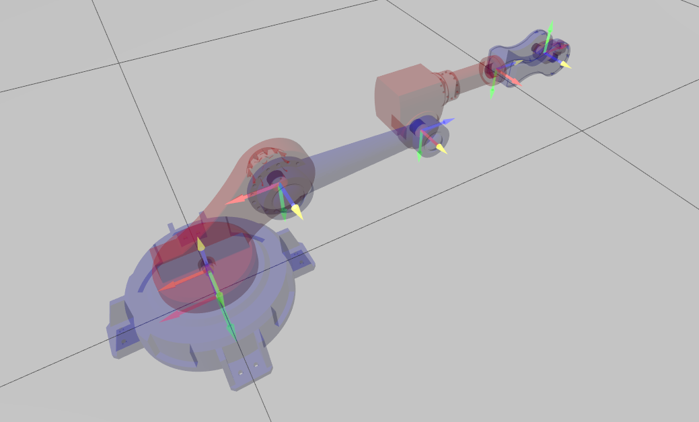

# Manipulator


## Tools
- [Freecad](https://www.freecad.org/) for design.
- [Gazebo](https://gazebosim.org/home) harmonic for simulation.

## Setup
1. The links are modelled in FreeCAD. [manipulator.FCStd](./manipulator.FCStd)
2. The links are exported in `.dae` format in the [meshes](./meshes) directory.
3. Gazebo simulation takes [SDF](https://sdformat.org/) file as input. The links and joints along with their placement and orientation is defined in this file (zero configuration of robot). [manipulator.sdf](./manipulator.sdf)

## Config
The [config](./config.toml) can be passed to the example using `--config` or `-c` flag.

## Execution
1. Run the simulation from the [manipulator](.) directory. This will block the terminal.
```bash
gz sim manipulator.sdf
```
2. Set the angles in the example. `theta_list`
3. From another terminal, run the manipulator example.
```
cargo r --example manipulator -- -c examples/manipulator/config.toml
```
4. The code will check if the simulation has started at every 2 second interval. Play the simulation in gazbo window.

## Explanation
- The clock is synced with the gazebo time, by listening to the `/clock` topic.
- A velocity is given as soon as the simulation starts. Given the distance and constant joint speeds, the duration is calculated accordingly. Velocity is set to $0$ as soon as duration is breached.
- Forward kinematics is used to calculate the transformation of the end effector.

## TODO
- [ ] Make joint configurable in [config.toml](./config.toml).
- [ ] Make individual joint velocity configurable in [config.toml](./config.toml)
- [ ] Add and configure the 6th link.
- [ ] Implement **inverse kinematics** for manipulator.